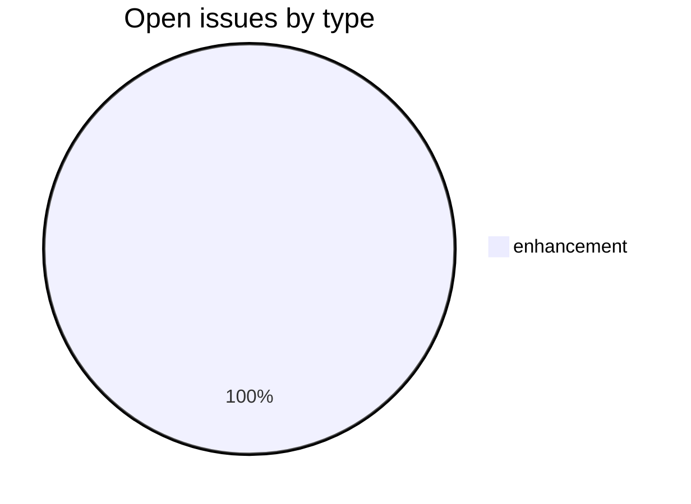
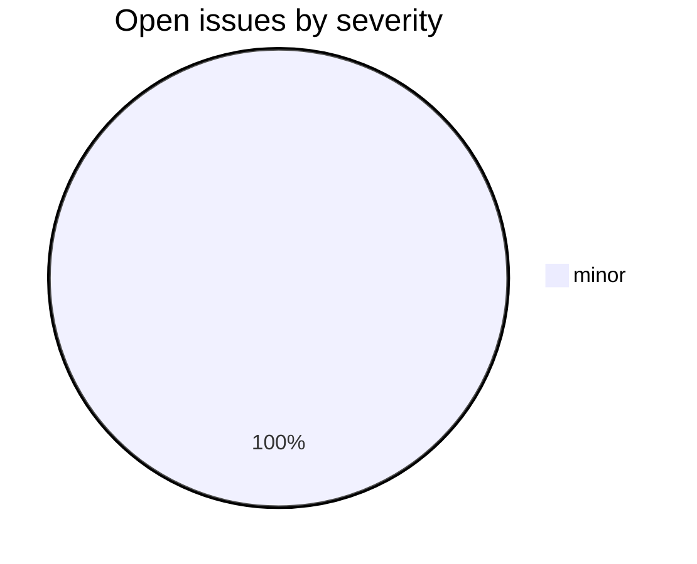

# csl-kale

_Created: 14-06-2026 · Last updated: 11-07-2026_

CDSL **scanned-book** repository in the [Sanskrit Lexicon](https://github.com/sanskrit-lexicon) project: a page-image scan of M. R. Kale, *A Higher Sanskrit Grammar* (a standard reference grammar for Sanskrit students), with two browser front-ends for reading the scanned pages.

## Contents

| Path | What it is |
|---|---|
| [`png/`](https://github.com/sanskrit-lexicon/csl-kale/tree/main/png) | 736 page-image scans, `kale_Page_NNN.png` |
| [`disp/`](https://github.com/sanskrit-lexicon/csl-kale/tree/main/disp) | PHP page-viewer (`index.php` + `serveimg.php` image server, `ajax.js`/`main.js`, `kale.css`) |
| [`disp1/`](https://github.com/sanskrit-lexicon/csl-kale/tree/main/disp1) | JavaScript/HTML page-viewer (`index.html`); its `pywork/` Python scripts generate the `filecode.js`/`filetop.js` navigation indexes |

The `disp/` viewer maps a requested page number to `png/kale_Page_$page.png` (with a fixed offset between the printed and file page numbers) and serves it through `serveimg.php`. Open issue [#2 (Javascript version)](https://github.com/sanskrit-lexicon/csl-kale/issues/2) tracks completing the pure-JS `disp1/` alternative to the PHP viewer.

## Issues Overview

Snapshot 11-07-2026: **1** open, **1** closed.

### By Milestone

| Milestone | Open | Closed | Total |
|---|---:|---:|---:|
| API Stability | 0 | 0 | 0 |
| User Experience | 1 | 0 | 1 |
| Data Quality | 0 | 0 | 0 |
| Developer Experience | 0 | 0 | 0 |
| Community | 0 | 0 | 0 |

### By Type

### By Severity

## GitHub Issue Conventions

Follows the [Cologne tooling-repo taxonomy](https://github.com/sanskrit-lexicon/csl-observatory/blob/main/runbook/cologne-tooling-runbook.md):

- **Type labels** across bug / feature / enhancement / performance / tech-debt / security / documentation / infrastructure / question categories
- **4 severity levels**: `trivial`, `minor`, `major`, `critical`
- **5 milestones**: API Stability, User Experience, Data Quality, Developer Experience, Community
- **Domain labels** scoped to scanned-book: `domain:ocr`, `domain:image-quality`, `domain:metadata`
- **Org Project**: [Tooling Roadmap](https://github.com/orgs/sanskrit-lexicon/projects/9)

See [`CLAUDE.md`](https://github.com/sanskrit-lexicon/csl-kale/blob/main/CLAUDE.md) for the full label list and per-category conventions.

## License

GPL-3.0 — see [`LICENSE`](https://github.com/sanskrit-lexicon/csl-kale/blob/main/LICENSE) and [`CITATION.cff`](https://github.com/sanskrit-lexicon/csl-kale/blob/main/CITATION.cff).

---

_Dr. Mārcis Gasūns_
